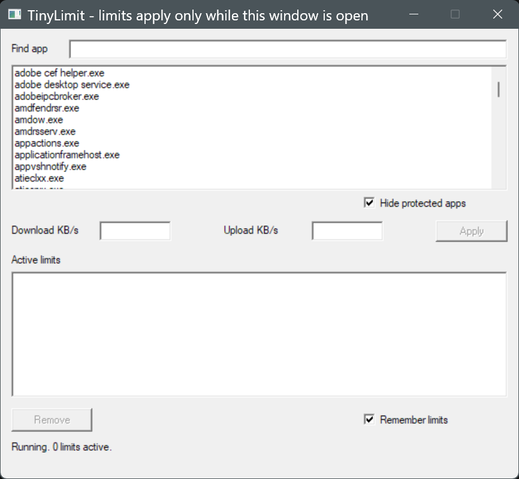
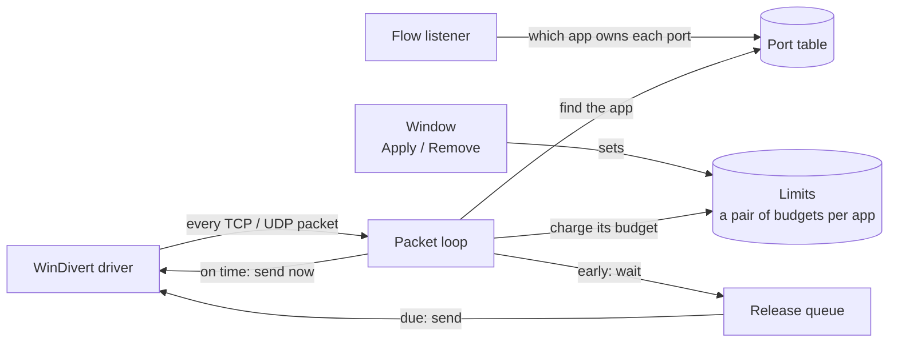

<div align="center">

# TinyLimit

**Cap any Windows app's download and upload speed.**<br>
One Rust source file. Zero dependencies. Built to be audited.

[**Download for Windows (.zip)**](https://github.com/Ehab-0/tinylimit/releases/latest/download/TinyLimit-x64.zip) &nbsp;·&nbsp; [All releases](https://github.com/Ehab-0/tinylimit/releases/latest) &nbsp;·&nbsp; [Website](https://ehab-0.github.io/tinylimit/) &nbsp;·&nbsp; [Audit guide](#5-audit-guide) &nbsp;·&nbsp; [Specification](SPEC.md)

[](https://github.com/Ehab-0/tinylimit/actions/workflows/build.yml)



</div>

TinyLimit caps the download and upload speed of individual apps on Windows 10 and 11 (64-bit). You pick an app, type two numbers in KB/s, and press Apply. The whole program is one Rust source file with no third-party packages, written so that a stranger can read all of it.

**Status:** the code builds and its unit tests pass in CI on every push. The author has run it by hand on one Windows 11 PC. It has not been tested on other PCs, on Windows 10, or with VPN software, and no third party has audited it yet.

## At a glance

| | |
| --- | --- |
| **Source** | One file, [`src/main.rs`](src/main.rs), about 1,470 lines plus its unit tests |
| **Dependencies** | None. `Cargo.lock` lists one package: TinyLimit itself |
| **Network** | None. The program opens no sockets and makes no network requests |
| **Files written** | One: `limits.txt`, beside the .exe |
| **Installs** | Nothing. No service, no registry entries, no installer |
| **Driver** | [WinDivert](https://github.com/basil00/WinDivert) 2.2.2, unmodified, pinned by SHA-256 |
| **Needs** | Windows 10 or 11, 64-bit, run as administrator |

What it does:

- Limits one app by its .exe name, with separate download and upload speeds (whole KB/s; leave one empty for unlimited).
- Covers TCP and UDP over IPv4 and IPv6. Traffic to the same PC (loopback) is never touched.
- All processes with the same .exe name share one budget, so a browser with many processes gets one cap in total.
- Limits connections that were already open, and processes started later.
- A new, changed or removed limit takes effect within a second.
- Refuses to limit core Windows processes (`svchost.exe`, `lsass.exe` and a few others) and itself.
- Remembers your limits between runs, unless you turn that off.
- Stops all limiting the moment you close the window.

## 1. Download and run

1. Download [`TinyLimit-x64.zip`](https://github.com/Ehab-0/tinylimit/releases/latest/download/TinyLimit-x64.zip) (the same file as `TinyLimit-<version>-x64.zip` on the [releases page](https://github.com/Ehab-0/tinylimit/releases/latest)) and unzip it.
2. Keep `tinylimit.exe`, `WinDivert.dll` and `WinDivert64.sys` together in one folder.
3. Run `tinylimit.exe` as administrator (Windows asks for it). Pick an app, enter download and/or upload KB/s, press Apply.

Administrator rights are needed because the WinDivert driver can only be opened by an administrator. Limits apply only while the window is open. The "Hide protected apps" box (ticked by default, not saved) hides the Windows core processes that TinyLimit refuses to limit anyway.

## 2. Verify the download

Every release is built by [GitHub Actions](https://github.com/Ehab-0/tinylimit/blob/main/.github/workflows/build.yml) from the public source.

Check the checksum (PowerShell, in the folder with the ZIP):

```powershell
(Get-FileHash TinyLimit-x64.zip -Algorithm SHA256).Hash
```

It must equal the line for that file in `SHA256SUMS.txt` on the release page. Then check the build attestation with the [GitHub CLI](https://cli.github.com/):

```
gh attestation verify TinyLimit-x64.zip --repo Ehab-0/tinylimit
```

The attestation step runs only for a public repository, so releases built while it was private have a checksum but no attestation.

## 3. How it works

Five threads, three pieces of shared state, one driver.



- The **flow listener** watches new connections and records which limited app owns each local port.
- The **packet loop** runs only while at least one limit exists. It receives every non-loopback TCP and UDP packet. Packets of unlimited apps go straight back out. Packets of a limited app are charged to that app's budget, then sent now, delayed, or dropped.
- Each budget holds one number: the earliest time its next packet may leave. Every packet is charged, delayed or not. A packet that would wait more than a second is dropped, which is what tells the sender to slow down. At most 50 ms of traffic can burst through.
- A **release thread** sends delayed packets when they are due, and a **watchdog** exits the process if the packet loop ever gets stuck.
- Download limiting is indirect: packets are delayed after they reach your PC, and the remote server slows down in response.

## 4. Methodology

TinyLimit runs as administrator and sits in the path of your network traffic, so the design goal is that anyone can check it for themselves. Features and peak speed come second to that.

**Specification first.** [SPEC.md](SPEC.md) was written before the code. It gives every rule an ID (constraints C1-C9, behaviour F1-F18, safety S1-S9), lists the hard limits, and lists what is out of scope: no service, no tray icon, no history or charts, no quotas, no update checks. Each feature that is left out is code nobody has to read.

**Small, and enforced.** One source file, `src/main.rs`. Rust standard library only: no third-party crates, no build script. CI fails if `Cargo.lock` lists more than one package or if the file grows past its line cap. The spec asked for 900 lines. The finished program needed 1,470, so the cap is now 1,500. Lines are only a proxy for reading time, so the code is kept plain instead of short: one statement per line, descriptive names, a banner comment for each part. Nothing was compressed to hit a number.

**Easy to read in order.** The pure logic (speed budgets, name rules, the limits table, the `limits.txt` parser) has no Windows types in it, and its unit tests run on any operating system. The risky part is kept apart: every call into Windows or the driver is declared in one section, sits in an `unsafe` block, and has a one-line comment saying why it is sound. There are 37 of those blocks and one list of the outside functions (section 5), so the whole surface can be checked on one screen.

**Fails safe.** Nothing needs cleaning up after a crash, a kill or a close: Windows closes the driver handles, and traffic flows normally at once. With no limits set, no packets are diverted at all. Release builds abort on panic, a watchdog exits the process if the packet loop stalls, and the program installs no service and touches no registry. The one file it writes is `limits.txt`.

**Facts looked up, not remembered.** The Windows structures and constants were checked against Microsoft's documentation and the Windows SDK headers, and the WinDivert layout against the header in the official 2.2.2 download. Compile-time size assertions guard every hand-written structure.

**Pinned inputs, public build.** The Rust version, the WinDivert download (by SHA-256) and every GitHub Action (by commit) are fixed in the repository. Each push runs the checks above, a build with zero warnings and the tests. Releases are built only by GitHub Actions, with a build attestation once the repository is public.

**What this does not give you.** No third party has audited the code. The "readable in an hour" goal has not been measured. WinDivert is signed kernel code written by someone else, and nothing here makes it smaller (section 6).

## 5. Audit guide

Everything is in `src/main.rs`. Read it top to bottom; each part has a banner comment:

| Part | Content |
| --- | --- |
| 1 | Header comment: what it does, the five threads, the outside functions |
| 2 | Constants and every user-facing string |
| 3 | Pure logic (no Windows types): budgets, port index, name rules, limits table, limits file |
| 4 | Foreign declarations: WinDivert (loaded at run time), then Windows |
| 5 | Engine: shared state, flow listener, port scan, packet loop, release thread, watchdog |
| 6 | Window: controls, message handler, Apply and Remove |
| 7 | `main` |
| 8 | Unit tests for part 3 |

<details>
<summary><strong>Outside functions called</strong> (the complete list, matching the declarations in part 4)</summary>

- WinDivert.dll, loaded with `LoadLibraryW` from the folder of the .exe by absolute path: `WinDivertOpen`, `WinDivertRecv`, `WinDivertSend`, `WinDivertShutdown`, `WinDivertClose`, `WinDivertHelperParsePacket`
- kernel32: `LoadLibraryW`, `GetProcAddress`, `GetLastError`, `OpenProcess`, `QueryFullProcessImageNameW`, `CloseHandle`, `CreateToolhelp32Snapshot`, `Process32FirstW`, `Process32NextW`, `GetModuleHandleW`
- iphlpapi: `GetExtendedTcpTable`, `GetExtendedUdpTable`
- user32: `RegisterClassW`, `CreateWindowExW`, `DefWindowProcW`, `GetMessageW`, `IsDialogMessageW`, `TranslateMessage`, `DispatchMessageW`, `SendMessageW`, `SetWindowTextW`, `GetWindowTextW`, `EnableWindow`, `SetTimer`, `PostQuitMessage`, `MessageBoxW`, `LoadCursorW`, `AdjustWindowRect`
- gdi32: `GetStockObject`

</details>

Checks you can run yourself:

| Claim | How to check |
| --- | --- |
| 37 `unsafe` blocks, each commented | `grep -c "unsafe {" src/main.rs`, then read the line above each one |
| Zero dependencies | `[dependencies]` in `Cargo.toml` is empty; `Cargo.lock` has one `[[package]]` |
| No network code | Search `src/main.rs` for `std::net`: no matches |
| No registry use | None of the outside functions (section above) touches the registry; search for `RegOpen`, `RegCreate`, `RegSetValue`: no matches |
| One file written | Search for `fs::write`: only `limits.txt.tmp`, renamed to `limits.txt` |
| Size | 1,470 lines above `#[cfg(test)]`; CI cap 1,500 (SPEC.md says 900, so the cap is a known departure) |

Running `cargo test` needs an elevated terminal, because the administrator manifest is linked into the test program too (Windows error 740 otherwise).

## 6. About the driver

TinyLimit needs [WinDivert](https://github.com/basil00/WinDivert) 2.2.2, an open-source, signed Windows kernel driver written by someone else. It is third-party kernel code, and this project cannot shrink it. It ships unmodified.

SHA-256 of the files in `WinDivert-2.2.2-A.zip` (x64 folder), computed from the official download:

| File | SHA-256 |
| --- | --- |
| `WinDivert.dll` | `C1E060EE19444A259B2162F8AF0F3FE8C4428A1C6F694DCE20DE194AC8D7D9A2` |
| `WinDivert64.sys` | `8DA085332782708D8767BCACE5327A6EC7283C17CFB85E40B03CD2323A90DDC2` |

The ZIP itself is `63CB41763BB4B20F600B6DE04E991A9C2BE73279E317D4D82F237B150C5F3F15`; the build fails if the download differs. These hashes equal the ones OpenNetLimit publishes for the NuGet package.

Antivirus may flag the driver, because packet-diverting drivers look like malware to some scanners. The driver stays loaded after TinyLimit closes, until reboot. To stop it sooner, run in an administrator prompt:

```
sc stop WinDivert
```

## 7. The unsigned .exe and SmartScreen

`tinylimit.exe` is not code-signed (a certificate is a yearly paid cost). Windows SmartScreen may warn on first run. Use the checksum and attestation in section 2 to confirm the file is the one GitHub built.

## 8. `limits.txt` and the Remember switch

With "Remember limits" ticked (the default), limits are saved to `limits.txt` beside the .exe each time you apply or remove one, and loaded at the next start.

```
remember on
500 200 chrome.exe
0 100 some app.exe
```

Line 1 is `remember on` or `remember off`. Each other line is `<download KB/s> <upload KB/s> <exe name>`; 0 means unlimited, and the name is the rest of the line. Bad lines are skipped and counted in the status line. Unticking the box rewrites the file to hold only `remember off`; limits already active stay active until the window closes.

## 9. Known limitations

- While any limit is active, all TCP and UDP packets pass through the tool; unlimited apps' packets are passed straight on.
- Connections are matched to apps by local port, protocol and IP version. Two apps using the same port number on different local addresses can be confused.
- The first few packets of a brand-new connection may pass before its owner is known.
- Download limiting is indirect: packets are delayed after they reach the PC, and the sender then slows down. Speed settles within a few seconds.
- Not tested with VPN software.
- 64-bit Windows only.

## 10. Project web page

The one-page site in `docs/` is served by GitHub Pages at <https://ehab-0.github.io/tinylimit/>, straight from the `docs/` folder of `main`.

## Licence

TinyLimit is MIT licensed (see `LICENSE`). WinDivert is licensed separately (see `WinDivert-LICENSE.txt` in the ZIP). The full specification is in [SPEC.md](SPEC.md).
